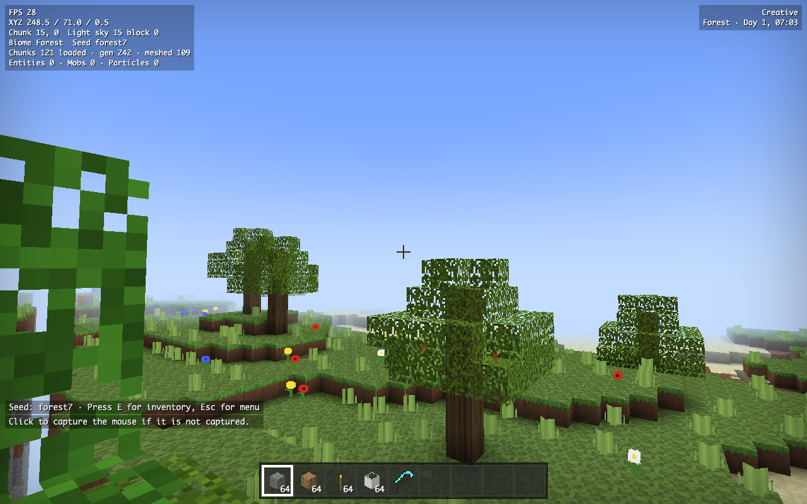

# Voxelcraft

A Minecraft-style voxel survival game that runs in the browser from **one HTML file**. No build step, no bundler, no server required: open `index.html` and play.



Built with [Three.js](https://threejs.org/) (r128) and [JSZip](https://stuk.github.io/jszip/), both loaded from cdnjs. Everything else, including the noise functions, meshing, lighting, physics, textures and UI, is written from scratch inside `index.html`.

## Run it

- **From this workspace:** double-click the top-level `Play AI Minecraft Clones.cmd` launcher and open the Voxelcraft card. The launcher serves the game over HTTP, so the installed `resourcepack.zip` loads automatically.
- **Simplest:** double-click `index.html`. Chrome, Edge and Firefox all work.
- **With a resource pack that loads automatically:** serve the folder over HTTP and drop a pack next to the page as `resourcepack.zip`:

  ```bash
  python3 -m http.server 8765
  # then open http://127.0.0.1:8765/index.html
  ```

  Packs can also be dragged onto the title screen or loaded from the pause menu at any time, including when the file is opened directly from disk.

Opening `index.html` directly uses the procedural fallback until you choose or drop the ZIP; browsers do not allow a `file://` page to fetch a sibling pack automatically.

## Features

**World**
- Chunked voxel world (16x128x16 chunks), streamed around the player, configurable render distance.
- Greedy meshing with per-face culling, ambient occlusion and smooth lighting, drawn with a custom atlas shader.
- Procedural terrain from inline simplex noise: ten biomes (plains, forest, birch forest, desert, mountains, snowy tundra, taiga, beach, ocean, deep ocean), rolling hills and ridged mountains, 3D-noise caves, ravines, depth-banded ore veins, bedrock, lava pools, oak/birch/spruce trees, flowers, tall grass, cacti, pumpkins.
- Generated structures: dungeons with monster spawners and loot chests, ruined portals.

**Lighting and environment**
- Separate sky-light and block-light propagation with incremental updates.
- Day/night cycle with sun, moon and stars; rain and snow by biome.
- Flowing water and lava (source/flow levels, infinite water, obsidian and cobblestone generation), fire spread, falling sand and gravel.

**Gameplay**
- Survival and creative modes (`G` to switch). Health, hunger, drowning, fire, lava and fall damage, respawn.
- Mining with break-progress cracks, tool tiers and durability, block drops that bob and are picked up on contact.
- Full inventory with 2x2 crafting, crafting table (3x3, 60+ recipes), furnace (fuel, smelting, cooking), chests, doors, ladders, torches, buckets, hoes and farming with crop growth stages.
- Redstone basics: wire with signal falloff, redstone torches, levers, redstone lamps, doors, TNT.
- Passive mobs (pig, cow, sheep, chicken; sheep can be sheared) and hostile mobs (zombie, skeleton, creeper) that spawn in darkness, chase, shoot or explode, and burn in daylight. Melee and bow combat with knockback.
- Autosave to localStorage (deflated), plus JSON export and import. Worlds are reproducible from their seed.

**Resource packs**
- Loads standard Minecraft Java resource packs (`.zip`). Block and item textures are matched by vanilla file name; 16x, 32x and 64x packs are handled; animated textures use their first frame; OptiFine/MCPatcher assets and `.mcmeta` files are ignored; legacy (1.12) names are aliased.
- Handles Java's special chest entity sheet by deriving the three square chest faces used by Voxelcraft.
- Anything a pack does not provide falls back to procedurally generated 16x16 pixel art, so the game is fully playable with zero external files.

## Item coverage report

The Java 26.2 comparison is in [`reports/item-texture-audit.md`](reports/item-texture-audit.md). The complete machine-readable list of Java items not implemented in Voxelcraft is [`reports/items-not-in-game.csv`](reports/items-not-in-game.csv).

## Controls

| Key | Action |
| --- | --- |
| `W A S D` / mouse | Move / look |
| `Space`, `Shift`, `Ctrl` | Jump or swim, sneak, sprint |
| Double-tap `Space` | Toggle flying (creative) |
| Left / right click | Mine or attack / place, use, eat |
| `1`-`9`, scroll | Select hotbar slot |
| `E`, `Q`, `F` | Inventory, drop item, pick block (creative) |
| `G`, `T`, `R`, `F3` | Toggle mode, skip to morning, toggle weather, debug overlay |
| `Esc` | Pause menu, release the mouse |

Right-click crafting tables, furnaces, chests, doors and levers to use them. Flint and steel ignites TNT.

## Code layout

`index.html` is organised as numbered systems, each under a `====` banner, so it can be read top to bottom:

1. Utilities (constants, seeded PRNG, simplex noise)
2. Block and item registries
3. Recipes
4. Procedural textures
5. Texture atlas and resource-pack loader
6. World storage and the block-change pipeline
7. Terrain generation
8. Lighting engine
9. Meshing (shader, greedy mesher, block models)
10. Chunk manager
11. Physics, input, player
12. Interaction (raycast, mining, placing, using)
13. Inventory and container screens
14. Entities (drops, arrows, TNT, particles, explosions)
15. Mobs
16. Simulation (fluids, fire, random ticks, redstone)
17. Sky and weather
18. HUD, persistence, menus
19. Bootstrap and main loop

Unfinished or simplified features are marked in the code with `// STUB:`; the full list is at the bottom of the script. Highlights of what is not there yet: the Nether and the End, villages and mineshafts, villager trading, enchanting and brewing, redstone repeaters and pistons, mob textures from resource packs, audio.

## Third-party content

- Resource packs are **not committed**. This workspace has a local, git-ignored `resourcepack.zip` copied from the supplied official Java 26.2 reference bundle. Mojang/Microsoft owns that art; keep it local unless your intended distribution complies with the applicable EULA and usage guidelines.
- Other packs, including [New Default+](https://modrinth.com/resourcepack/new-default-plus), carry their own licenses; download them yourself and place the ZIP next to `index.html` as `resourcepack.zip`.
- Voxelcraft is an independent project. "Minecraft" is a trademark of Mojang Studios / Microsoft; this project is not affiliated with or endorsed by them.

## License

[MIT](LICENSE)
